<div align="center">

# GrayFSM

**Automated finite-state-machine optimisation via Gray-code encoding.**

[](https://www.python.org/)
[](https://react.dev/)
[](https://fastapi.tiangolo.com/)
[](https://www.typescriptlang.org/)
[](https://www.postgresql.org/)
[](LICENSE)

</div>

GrayFSM is a full-stack web application for hardware engineers. It takes a
finite-state machine — states, transitions, outputs — and assigns to each
state a binary code such that **adjacent states differ in as few bits as
possible**. Where a single-bit transition is impossible at a fixed encoding
width, the optimiser inserts intermediate dummy states to enforce one. The
output is synthesisable Verilog or VHDL with no glitches caused by
multi-bit register changes.

<p align="center">
  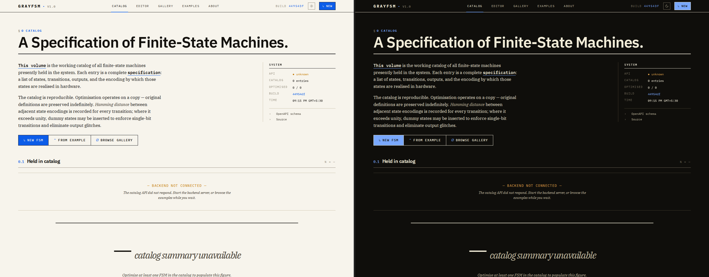
</p>
<p align="center"><sub><em>The Catalog &mdash; light and dark themes side by side. Set in IBM Plex.</em></sub></p>

---

## Why this exists

When an FSM transitions between states whose binary encodings differ by more
than one bit, the bits do not switch at the same instant. The intermediate
values cause **glitches** — momentary wrong outputs that propagate through
combinational logic and can cause race conditions or incorrect signals at
downstream registers.

Gray-coded transitions, where every adjacent pair of state encodings differs
in exactly one bit, eliminate this class of fault by construction. Frank
Gray described the encoding in 1947 for pulse-code modulation; the geometry
of the underlying hypercube is older still. GrayFSM operationalises both:
it computes the encoding, inserts dummy states where the geometry doesn't
fit, and emits HDL ready for synthesis.

---

## How it works

```
1. ENCODE    Assign Gray codes to every state.
             Adjacent codes differ by exactly one bit.

2. ANALYSE   Build the n-dimensional hypercube graph.
             Vertices = codes; edges = bit-flips.

3. OPTIMISE  For every transition with Hamming distance > 1:
                Find the shortest path through the hypercube
                Insert dummy states at each intermediate code
             Result: every transition flips exactly one bit.
```

A two-bit jump is split into two one-bit hops:

```
    000 ──▶ 111         becomes        000 ─▶ 001 ─▶ 011 ─▶ 111
    Hamming distance 3                       │      │
                                             ▼      ▼
                                       dummy states inserted
```

A dummy state lengthens the transition by one clock; a glitch lengthens it
by forever. The trade is rarely close.

---

## Algorithms shipped

Three optimisers are available; each operates on a copy of the
specification and never mutates the original.

| Algorithm | Complexity | Trade-off |
|---|---|---|
| **Greedy** | `O(T log N)` | Fast, locally optimal. Often matches the global optimum on small machines. |
| **BFS-optimal** | `O(T · N)` | Globally optimal under bit-width constraint. Slower; smart encoding-reuse. |
| **Simulated annealing** | `O(I · T)` | Reassigns the encodings themselves rather than inserting dummies. Escapes local optima via temperature-driven acceptance. |
| **Genetic algorithm** | `O(G · P . T)` | Evolves a population of Gray-code assignments via selection, crossover, and random mutation each generation. Trades more compute for a broad exploration of the encoding search space. |

---

## Architecture

```
┌─────────────────────────────────────────────────┐
│                    Frontend                      │
│  React 18 · TypeScript · Tailwind · ReactFlow   │
│  Zustand · React Query · Recharts · Three.js    │
└──────────────────────┬──────────────────────────┘
                       │ REST API
┌──────────────────────▼──────────────────────────┐
│                   Backend                        │
│  FastAPI · SQLAlchemy 2.0 (async) · NetworkX     │
│  Pydantic · Alembic · BackgroundTasks            │
├──────────────────────┬──────────────────────────┤
│      PostgreSQL      │           Redis           │
│       (storage)      │          (cache)          │
└──────────────────────┴──────────────────────────┘
```

---

## Tour of the app

<table>
  <tr>
    <td width="50%">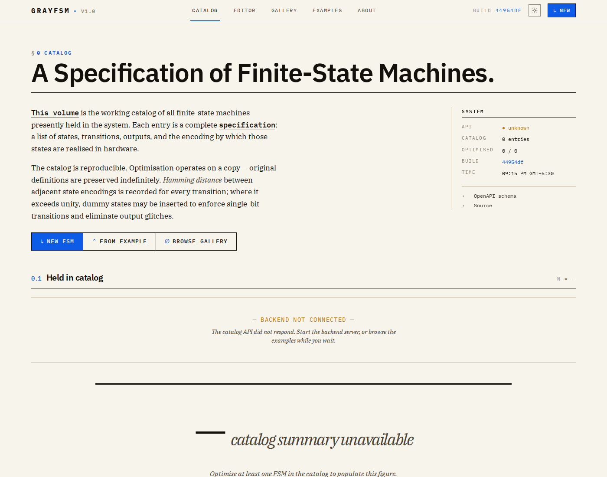</td>
    <td width="50%">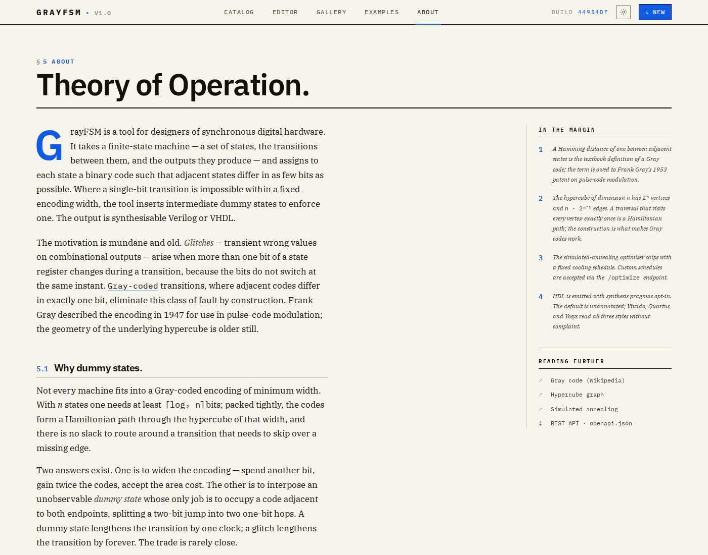</td>
  </tr>
  <tr>
    <td><sub><strong>§ 0 Catalog</strong> — every FSM in the system is a numbered specification entry. Sticky <em>System</em> sidebar shows live API / build / cache state.</sub></td>
    <td><sub><strong>§ 5 Theory of Operation</strong> — long-form serif essay with drop cap and numbered marginalia, covering Gray code, dummy states, and the algorithms.</sub></td>
  </tr>
  <tr>
    <td width="50%">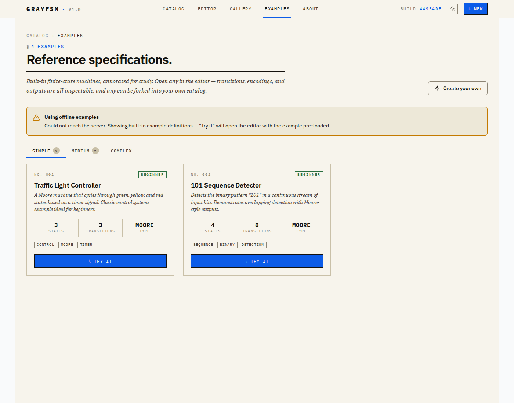</td>
    <td width="50%">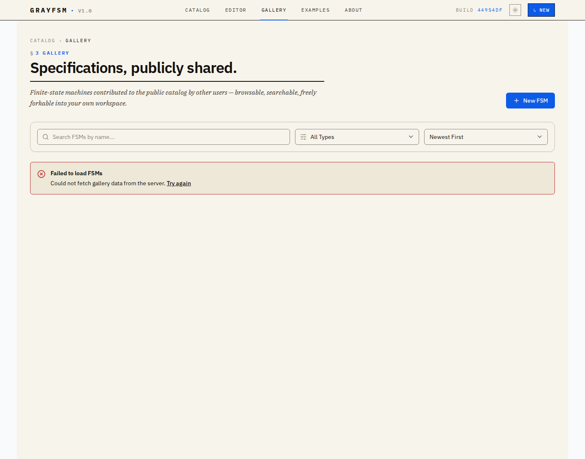</td>
  </tr>
  <tr>
    <td><sub><strong>§ 4 Examples</strong> &mdash; reference specifications. Traffic-light controller, 101 sequence detector, vending machine, elevator.</sub></td>
    <td><sub><strong>§ 3 Gallery</strong> — publicly shared FSMs, browsable, searchable, freely forkable. Numbered datasheet entry tiles.</sub></td>
  </tr>
  <tr>
    <td width="50%">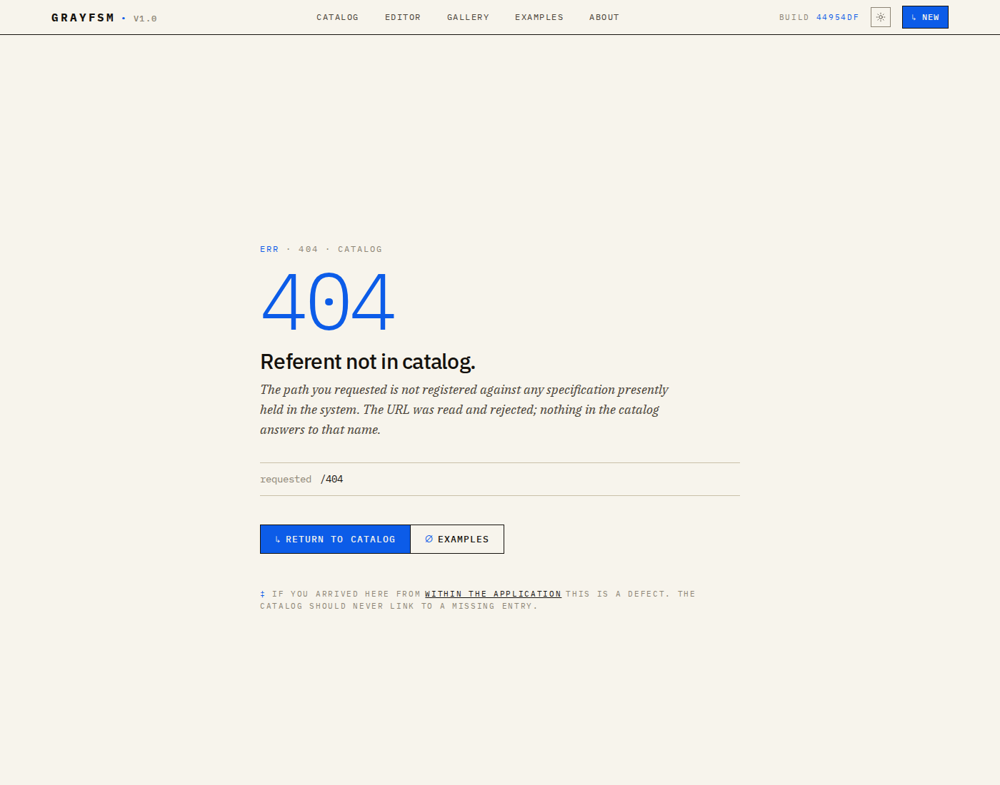</td>
    <td width="50%">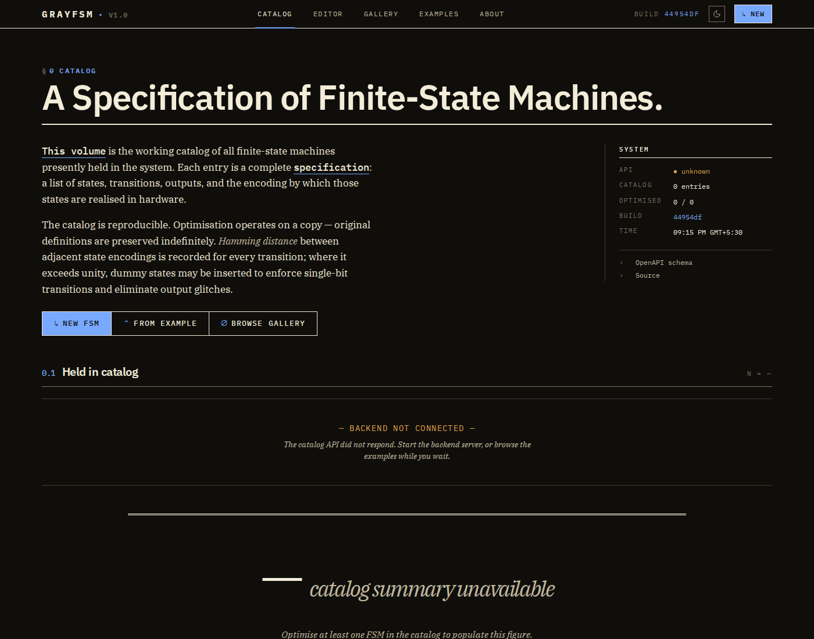</td>
  </tr>
  <tr>
    <td><sub><strong>404 — Referent not in catalog.</strong> Path echo, command-key actions, and a footnote explaining that arriving here from inside the app is a defect.</sub></td>
    <td><sub><strong>Dark theme</strong> — every page, primitive, chart, and visualisation flips uniformly via a single class on <code>&lt;html&gt;</code>.</sub></td>
  </tr>
</table>

## Process to generate dummy states : 

<p align="center">
  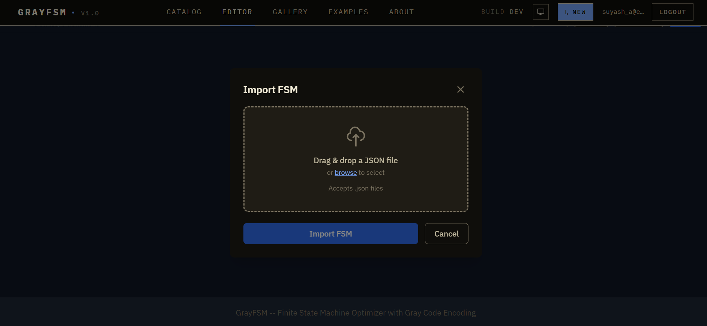
</p>
<p align="center">
  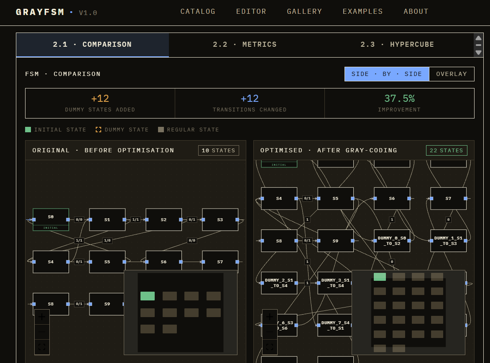
</p>
<p align="center">
  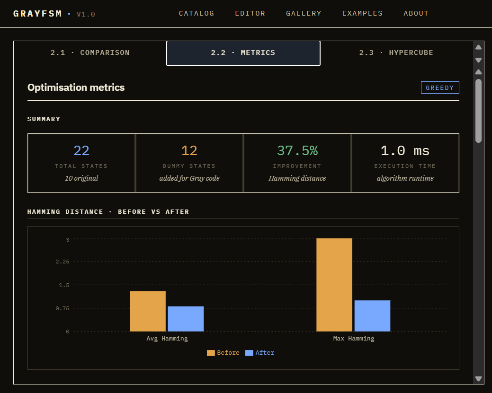
</p>
<p align="center">
  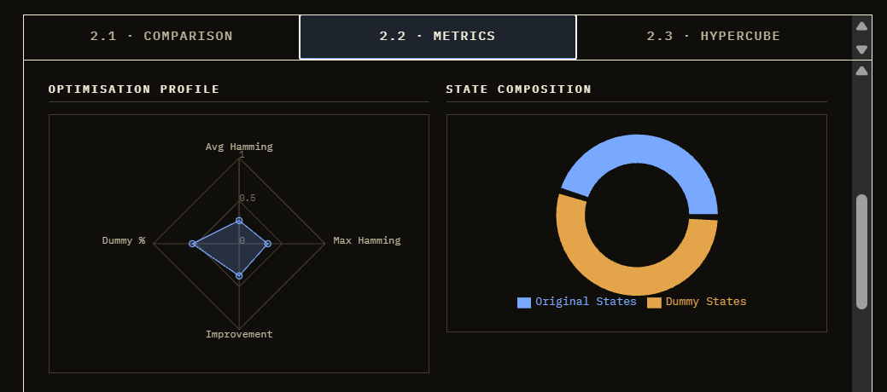
</p>
<p align="center">
  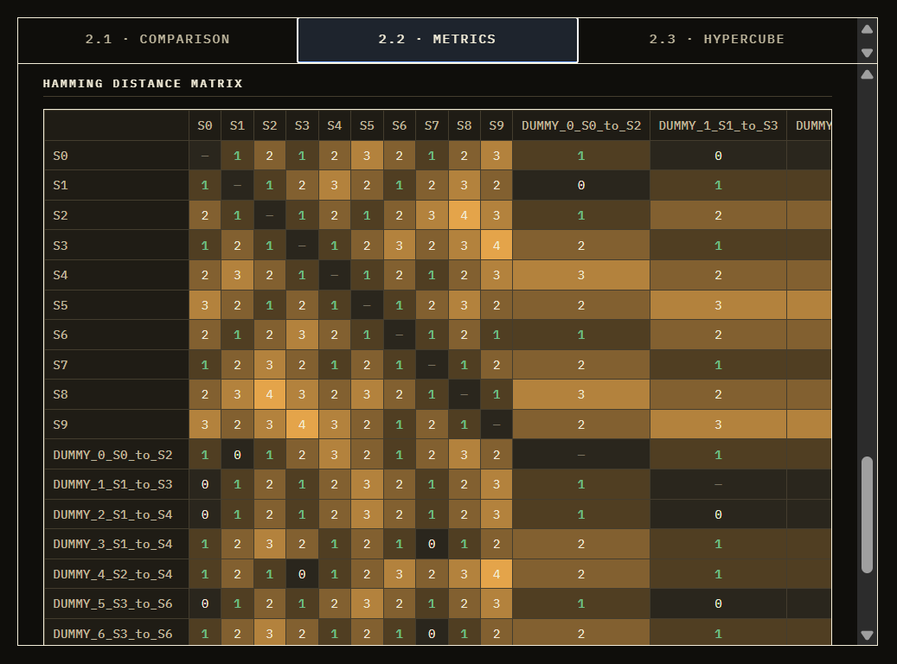
</p>
<p align="center">
  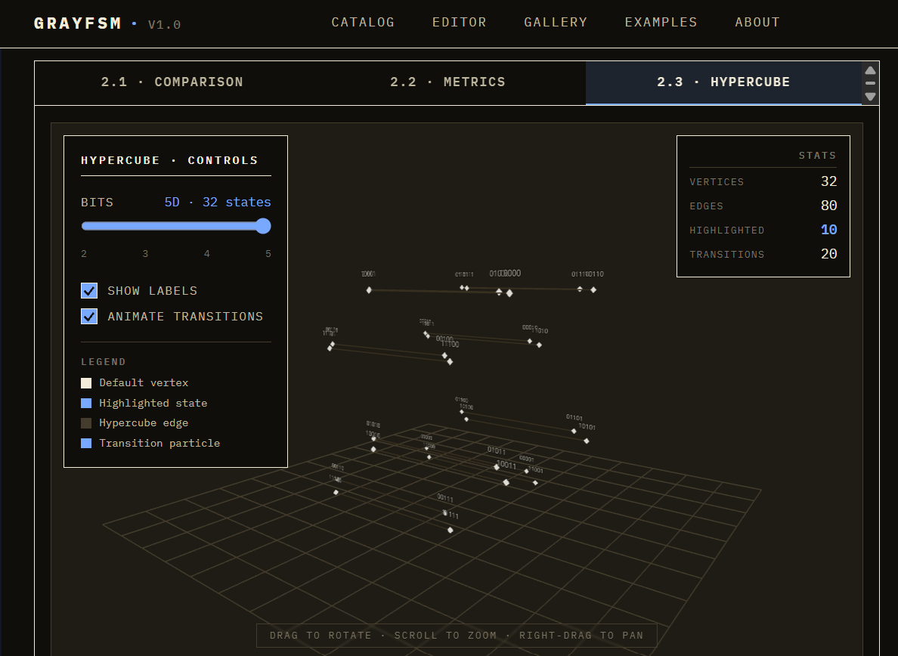
</p>
---

## Quick start

### Option 1 &mdash; Docker Compose (recommended)

```bash
cd infrastructure/docker
docker compose up -d

# Apply database migrations on first startup
# (the backend image runs uvicorn only, not migrations)
docker compose exec backend alembic upgrade head
```

| Service | URL |
|---|---|
| Frontend | http://localhost:3000 |
| Backend API | http://localhost:8000 |
| API docs (Swagger) | http://localhost:8000/docs |
| Prometheus | http://localhost:9090 |
| Grafana | http://localhost:3001 |

### Option 2 &mdash; Manual development setup

**Backend:**

```bash
cd backend
python -m venv venv
source venv/bin/activate
pip install -r requirements.txt

# PostgreSQL + Redis
docker run -d --name grayfsm-pg \
  -e POSTGRES_USER=grayfsm -e POSTGRES_PASSWORD=changeme \
  -e POSTGRES_DB=grayfsm -p 5432:5432 postgres:15-alpine
docker run -d --name grayfsm-redis -p 6379:6379 redis:7-alpine

# Configure environment (REQUIRED — config defaults are runtime-rejected
# placeholders so a missing DATABASE_URL fails fast at startup, not at
# the first SQL query)
cp .env.example .env

# Apply database migrations (required on first clone)
alembic upgrade head

# Run server
uvicorn app.main:app --reload --port 8000
```

**Frontend:**

```bash
cd frontend
npm install
npm run dev    # → http://localhost:3000
```

**Run all checks at once:**

```bash
make check     # ruff + mypy + pytest + tsc + vitest
```

---

## Design system

The frontend is set in **IBM Plex Mono / Sans / Serif** &mdash; mono carries
data and numerals, sans carries headings, serif carries prose. The aesthetic
is _datasheet brutalism_: hairline rules, no rounded corners, asymmetric
grids, one accent colour. References include Texas Instruments and
Hewlett-Packard reference manuals from the late 1970s, executed with
contemporary typographic care.

| Token | Value | Role |
|---|---|---|
| `--paper` | `#f7f4ec` | Page background (warm cream) |
| `--ink` | `#14110d` | Body text (warm near-black) |
| `--rule` | `#c9c0a8` | Hairlines |
| `--accent` | `#0c5ce8` | Single accent — drop caps, key glyphs, selected rows, chart series |
| `--ok / --warn / --err` | `#2a6e3f` / `#c47a00` / `#c12a2a` | Status |

Light + dark theme is a single class flip on `<html>`. Every chart, badge,
React Flow node, and Three.js scene reads the active values via a
`useThemeColors` hook. A `prefers-color-scheme: dark` media query
falls back to dark tokens if the user hasn't set an explicit preference.

---

## Project structure

```
grayFSM/
├── backend/                     # FastAPI application
│   ├── app/
│   │   ├── api/v1/              # REST endpoints (FSM, optimize, export, health)
│   │   ├── core/                # Gray code, hypercube, optimisation algorithms
│   │   ├── models/              # SQLAlchemy 2.0 ORM (Mapped[] declarative)
│   │   ├── schemas/             # Pydantic request/response models
│   │   ├── services/            # Business logic
│   │   ├── middleware/          # Logging, rate limiting, error handling
│   │   └── main.py              # Application entry point
│   ├── alembic/                 # Migration history
│   ├── examples/                # Built-in example FSMs (JSON)
│   └── tests/                   # Unit + integration tests
├── frontend/                    # React application
│   ├── src/
│   │   ├── pages/               # Catalog, Editor, Optimisation, Export, Gallery, About
│   │   ├── components/
│   │   │   ├── ui/              # Datasheet primitives + legacy kit
│   │   │   ├── fsm/             # React Flow canvas + custom node/edge renderers
│   │   │   ├── visualization/   # HammingChart, ComparisonView, MetricsDashboard, Hypercube3D
│   │   │   └── layout/          # Navbar, AppLayout
│   │   ├── store/               # Zustand stores
│   │   ├── styles/globals.css   # Design-system tokens (light + dark)
│   │   └── api/                 # Axios client
│   └── tailwind.config.js       # Token-backed Tailwind theme
├── database/                    # Schema reference, seed queries
├── infrastructure/              # Docker Compose, Kubernetes, monitoring
├── e2e/                         # Playwright end-to-end tests
├── tests/                       # Integration, contract, load tests (full-stack)
└── README.md
```

---

## Tech stack

| Layer | Tooling |
|---|---|
| **Frontend** | React 18 · TypeScript 5 · Tailwind 3 · ReactFlow · Zustand · TanStack Query · Recharts · Three.js · IBM Plex |
| **Backend** | FastAPI · Python 3.10+ · SQLAlchemy 2.0 (async) · asyncpg · NetworkX · Pydantic v2 |
| **Database** | PostgreSQL 15 · Redis 7 |
| **Quality gates** | Ruff (E F W I N B UP, B904 enforced) · mypy strict · ESLint · Prettier · pre-commit (gitleaks, ruff, prettier, mypy, ESLint) |
| **Testing** | Pytest · Vitest · React Testing Library · Playwright · Schemathesis |
| **Infrastructure** | Docker Compose · Kubernetes · GitHub Actions · Prometheus · Grafana · Jaeger |

---

## API

| Method | Endpoint | Description |
|---|---|---|
| `POST` | `/api/v1/fsms` | Create a new FSM |
| `GET` | `/api/v1/fsms` | List FSMs (paginated, filterable, searchable) |
| `GET` | `/api/v1/fsms/{id}` | Get FSM by ID (visibility-aware) |
| `PUT` | `/api/v1/fsms/{id}` | Update FSM (owner-only) |
| `DELETE` | `/api/v1/fsms/{id}` | Delete FSM (owner-only) |
| `POST` | `/api/v1/fsms/{id}/fork` | Fork an FSM into your own catalog |
| `POST` | `/api/v1/fsms/{id}/optimize` | Run an optimisation algorithm |
| `POST` | `/api/v1/fsms/{id}/export` | Export to Verilog / VHDL / JSON / CSV / testbench |
| `GET` | `/api/v1/fsms/algorithms` | List available optimisation algorithms |
| `GET` | `/api/v1/examples` | List built-in example FSMs |
| `GET` | `/api/v1/categories` | List FSM categories |
| `POST` | `/api/v1/auth/register` | Register a user (rate-limited) |
| `POST` | `/api/v1/auth/login` | Log in &mdash; returns JWT + httpOnly cookie |
| `POST` | `/api/v1/auth/logout` | Blacklist the active token (header + cookie) |
| `GET` | `/api/v1/health` | Health check |

Full interactive docs live at `/docs` once the backend is running.

---

## Core algorithm files

| File | Purpose |
|---|---|
| `backend/app/core/gray_code.py` | Gray-code encoding / decoding, Hamming distance |
| `backend/app/core/hypercube.py` | N-dimensional hypercube graph, shortest paths via NetworkX |
| `backend/app/core/algorithms/greedy.py` | Greedy optimiser &mdash; fast, locally optimal |
| `backend/app/core/algorithms/bfs_optimal.py` | BFS optimiser &mdash; globally optimal under bit-width |
| `backend/app/core/algorithms/simulated_annealing.py` | Simulated-annealing optimiser &mdash; escapes local optima |
| `backend/app/core/fsm_model.py` | FSM validation, reachability analysis |
| `backend/app/core/exporters/` | Verilog, VHDL, JSON, CSV, SystemVerilog assertions, testbench |

---

## Tests

```bash
# Backend
cd backend && source venv/bin/activate
pytest tests/ -v                     # unit + integration

# Frontend
cd frontend
npm test                             # vitest
npm run build && npm run preview     # production build smoke

# Full-stack integration / contract
cd tests && pytest                   # requires running app

# E2E
cd e2e
npx playwright install --with-deps
npm test
```

CI runs ruff, mypy, eslint, vitest, pytest, alembic-check, contract tests,
gitleaks, and the full Docker build on every PR.

---

## Contributing

See [CONTRIBUTING.md](CONTRIBUTING.md) for the full guide: local setup, code
style, branching conventions, test layout, security disclosure.

Quick path for an experienced contributor:

1. Fork → branch (`feat/`, `fix/`, `chore/`, `redesign/`, etc.) → `cp backend/.env.example backend/.env`.
2. `pip install pre-commit && pre-commit install` — sets up gitleaks, ruff, prettier, mypy, and ESLint hooks.
3. Make changes, add tests, ensure `make check` passes (or run `ruff check`, `mypy`, `tsc --noEmit`, `vitest run`, `pytest` individually).
4. One PR per concern; squash-merge is default.

---

## License

MIT &mdash; see [LICENSE](LICENSE).

<div align="center">

❦

<sub>Set in <em>IBM Plex Mono</em>, <em>Sans</em>, and <em>Serif</em>. Composed datasheet-style.</sub>

</div>
